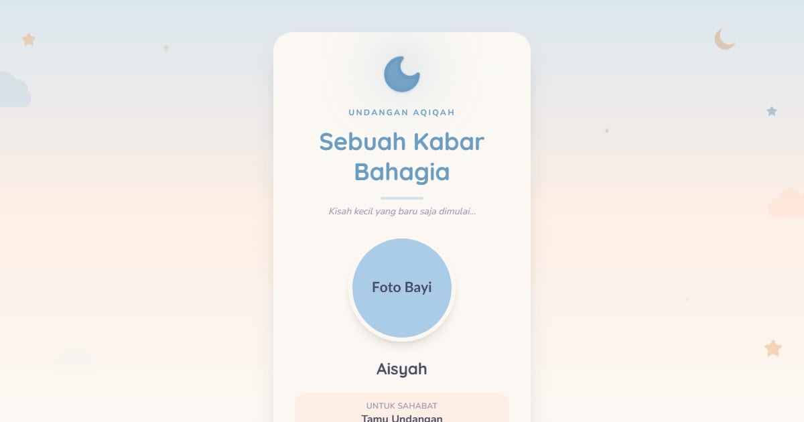

# Undangan Aqiqah — Aisyah Khairunnisa

Buku cerita bayi: sampul “Buka Buku Cerita”, halaman bernomor, data kelahiran, arti nama, album kecil, dan doa dari kerabat. Aqiqah digelar pada hari ketujuh kelahiran.

**Demo live:** https://undangan-aqiqah-puce.vercel.app



> Contoh dengan data fiktif: nama, tempat, dan nomor rekening tidak sungguhan. Formulir hanya demo dan mengatakannya terus terang. Foto adalah placeholder berlabel yang siap diganti.

## Fitur

- Sampul buku yang menyapa nama tamu (`?to=Nama`)
- Data kelahiran & arti nama
- Acara dengan tombol kalender, peta lokasi
- Album, RSVP & doa — mode demo
- **`/kirim` — alat tuan rumah:** ketik daftar tamu, dapatkan tautan pribadi tiap tamu dan pesan WhatsApp siap kirim. Semua diproses di peramban (localStorage), tanpa server.
- Musik latar dengan tombol putar/jeda (judul lagu tampil di tombol dan footer)
- Halaman 404 bergaya sendiri

## Mengganti isi

Seluruh isi ada di satu file: `lib/data.js` (nama, tanggal, acara, galeri, musik, pesan untuk /kirim). Komponen tidak perlu disentuh.

- **Tanggal:** ubah teks tanggal *dan* nilai ISO (`mainDate`, `start`, `end`) — hitung mundur dan tombol kalender memakai nilai ISO.
- **Peta:** contoh menunjuk area kota; ganti `q=` di `location.mapEmbed` dan `mapLink` dengan nama tempat atau koordinat.
- **Foto:** timpa berkas di `public/images/` dengan nama yang sama (potret 3:4).
- **Musik:** timpa `public/music/latar.mp3`, lalu ubah `music.title` dan `music.credit`. Pastikan Anda berhak memakai lagunya.

## Gambar & kredit

- `public/images/*.webp` — placeholder berlabel buatan sendiri (bukan foto stok), digambar ulang dari SVG agar tidak bergantung pada layanan luar.
- `public/music/latar.mp3` — *Wiegenlied (Guten Abend, gut’ Nacht) — Johannes Brahms*, kotak musik oleh stephan, domain publik — [Wikimedia Commons](https://commons.wikimedia.org/wiki/File:Lullaby_wound_up_clock_guten_abend_gute_nacht.ogg). Diperkecil ke MP3 mono 80 kbps.

## Teknologi

- Next.js 15.5 (App Router) dan React 19
- Tailwind CSS v4 (token tema di `app/globals.css`)
- Framer Motion, lucide-react
- Font: Quicksand, Caveat, Nunito (next/font)
- SEO: metadata, Open Graph, JSON-LD (WebSite), sitemap.xml, robots.txt

## Menjalankan secara lokal

```bash
npm install
npm run dev
```

Buka http://localhost:3000 — coba juga http://localhost:3000/?to=Nama+Tamu dan http://localhost:3000/kirim.

---

Bagian dari koleksi 8 undangan digital di [PortalUndangan](https://www.pintuweb.com/undangan-digital). Dibuat oleh [PintuWeb](https://www.pintuweb.com), jasa pembuatan website.
